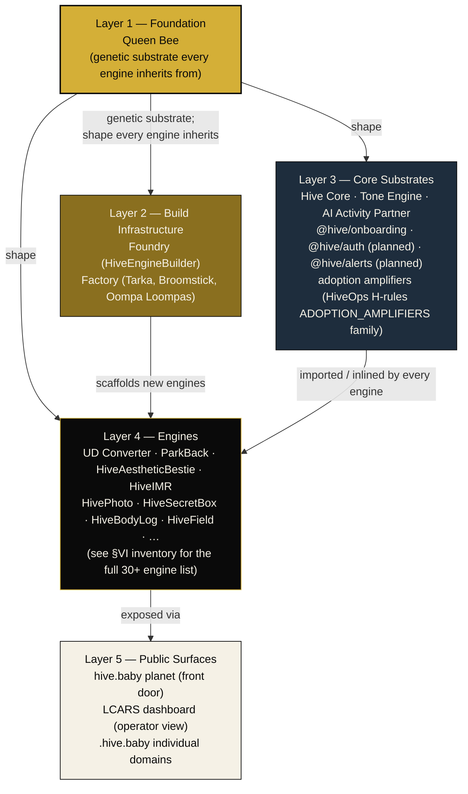
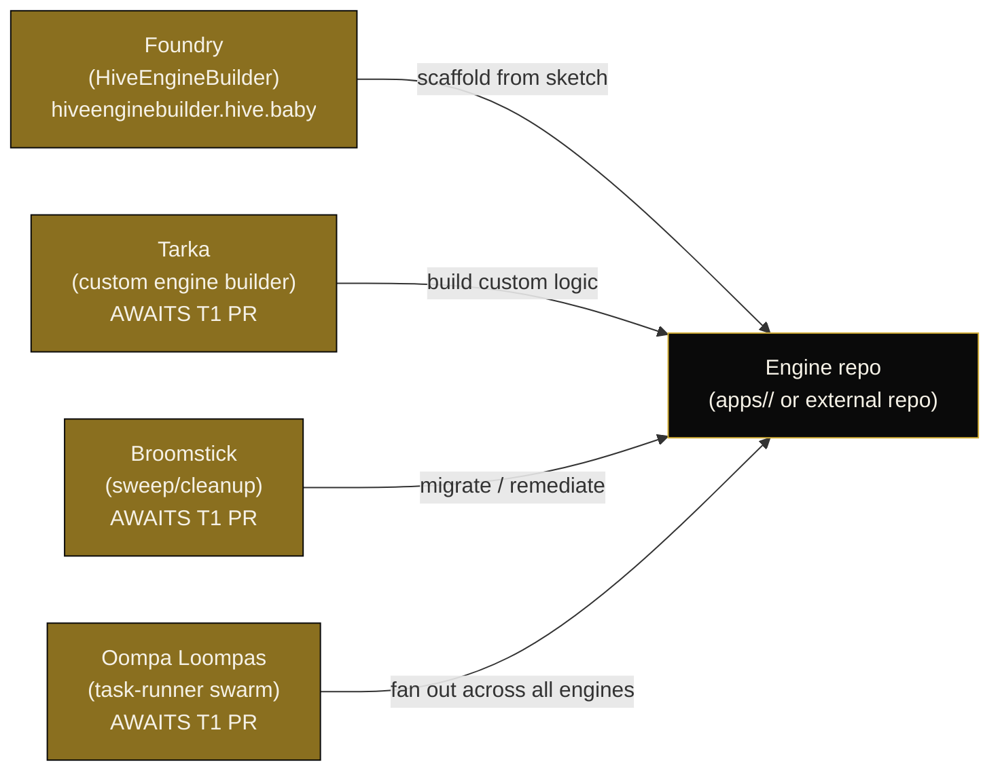
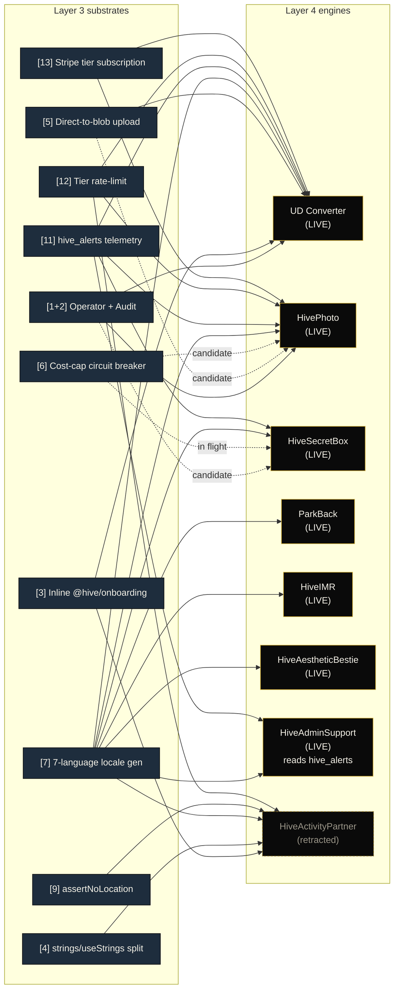
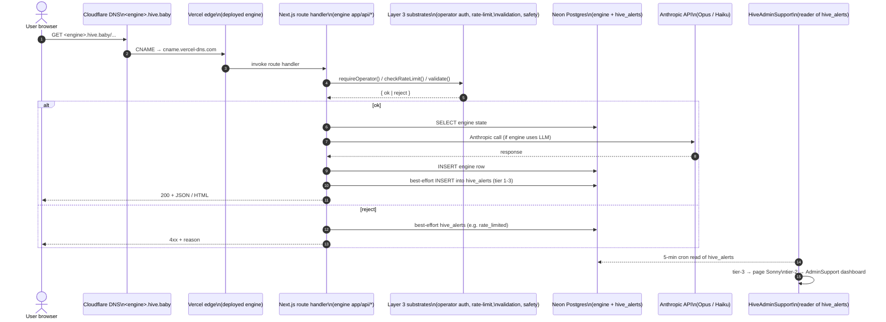
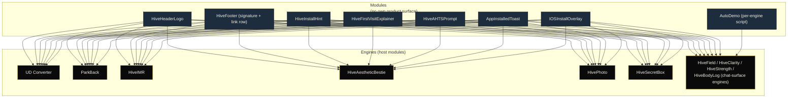

# Hive Architecture

> **v0.1 — 2026-05-08.** This is the pan-Hive architecture map intended to be visible from every chat, every CC session, every onboarding pass. It exists so a question like *"where does HiveAestheticBestie fit?"* or *"which substrate does this engine inherit?"* has one canonical answer.
>
> v0.1 captures everything verifiable today. Sections marked **AWAITS T1 PR** are the parts where the Queen Bee discovery work (T1, in flight) will replace placeholders with canonical detail. The rest is anchored to shipped code, the constitution, the substrate registry, and HiveOps verdicts.

## How to read this document

Four kinds of thing live in the Hive. Conflating them is the most common confusion.

| Concept | Owns? | Lifespan | Examples |
|---|---|---|---|
| **Engine** | Own purpose, workflows, output, public domain, pricing tier, DB schema, `ENGINE_GRAMMAR.md`. | Indefinite, until retired. | UD Converter, ParkBack, HiveAestheticBestie, HiveSecretBox, HiveIMR. |
| **Module** | Attaches to an engine via API import or component import. **No own product surface, no own deployment**. Build time hours, not days. | Lives as long as its host engine. | Hive header logo, footer signature, install hint banner, age-band gate, AHTS prompt. |
| **Substrate** | Registry-tracked pattern extracted when 3+ engines adopt it. May evolve into a shared `@hive/*` package. | Tracked indefinitely; entry becomes a historical pointer when extracted. | Operator role + audit dashboard, `hive_alerts` telemetry, tier-based rate limiting, Stripe tier subscription, 7-language locale generator. |
| **Adoption amplifier** | Cross-cutting growth/retention feature every engine inherits as part of the Hive integration contract. | Locked to the contract; HiveOps enforces presence. | "Add to home screen" prompt, first-visit explainer, auto-demo, planet placement, footer link row. |

**Rule of thumb.** If it has a Vercel project, it's an engine. If it's a React component imported by other engines, it's a module. If it's a TypeScript pattern repeated across engine source trees, it's a substrate. If it's a behavior every engine must exhibit (because the contract says so), it's an adoption amplifier.

Engines are the only thing the user directly experiences. The rest is how they're made and held together.

---

## The five-layer stack

The five layers are a **vertical inheritance stack**. A change in Layer 1 (Queen Bee) propagates to everything above it. A change in Layer 5 (a single engine's domain configuration) is local. Layers are *not* a deploy pipeline — engines deploy independently — they're a conceptual hierarchy that says *what depends on what*.

---

## Layer 1 — Queen Bee (foundation)

Queen Bee is the **genetic substrate** of every Hive engine. When CC scaffolds a new engine, the engine inherits Queen Bee's identity rules, design tokens, integration contract, governance hooks, and economic model — these are the things every Hive product has in common. Queen Bee is not a deployable codebase the way an engine is; it's the set of rules and patterns the engine begins life with.

The canonical Queen Bee surface is the constitution itself: every engine is bound by Constitution §I (identity), §II (engineering standards), §III (pricing model), §IV (workflow conventions), §V (HiveOps governance). HiveOps + HiveFinalize are the automated mechanisms that verify a candidate engine is, in fact, Hive — an engine without these verdicts isn't part of the colony.

Queen Bee inherits **into** every layer above it.

> **AWAITS T1 PR.** T1 is currently shipping the Queen Bee discovery work as a separate PR adding a §VII section to the constitution that names Queen Bee canonically (vs. the `queen-bee.hive.baby` engine listed in §VI inventory, which is a separate "IN PROGRESS" engine). When that PR lands, this section gets amended to reference the canonical surface. v0.1 captures the conceptual role; the precise mechanism (config file vs. tsconfig template vs. ENGINE_GRAMMAR baseline) is what T1's PR locks in.

---

## Layer 2 — Foundry + Factory (build infrastructure)

Tooling that builds engines, not engines themselves.

### Foundry — `HiveEngineBuilder` (`hiveenginebuilder.hive.baby`)

The builder UI. Operator-facing. Takes an engine sketch (purpose, inputs, outputs, pricing tier) and emits a scaffolded engine repo with `ENGINE_GRAMMAR.md`, the canonical onboarding stack, the favicon set, the manifest, the locale catalog, and the Vercel + Cloudflare wiring. Status: **LIVE**. Per CLAUDE.md D inventory.

The Foundry is the entry point Sonny uses when the conversation reaches "let's build a new engine for X." A new engine is built by sketching it in the Foundry and letting the Foundry emit a scaffold; CC then fills in the engine-specific logic. The Foundry uses Anthropic for the inference layer.

### Factory — Tarka, Broomstick, Oompa Loompas

> **AWAITS T1 PR.** v0.1 names the three Factory roles per the user's brief but does not yet have canonical documentation for them. T1's Queen Bee PR is expected to fix the names, scopes, and codebases. v0.1 placeholder:
>
> - **Tarka** — heavy-duty engine builder agent. Used when an engine needs more than a Foundry scaffold (custom integrations, novel UI surfaces, multi-engine workflows).
> - **Broomstick** — sweep / cleanup agent. Used for migrations, audit remediations, bulk renames across the colony.
> - **Oompa Loompas** — task-runner swarm. Used when a job parallelizes well across many engines (e.g. running HiveOps against every engine, generating locale catalogs across the fleet).
>
> When T1's PR lands, replace the descriptions with the canonical scope, the agent invocation surface, and the file paths.

---

## Layer 3 — Core substrates

Things that live across engines without being engines themselves.

### Core packages (`@hive/*` and inlined siblings)

| Package | Status | What it is |
|---|---|---|
| `@hive/onboarding` (`packages/hive-onboarding/`) | live (v0.1) | The PWA install hint, first-visit explainer, AHTS prompt, install toast, 7-locale catalog. Canonical source for the install + onboarding behavior every engine ships. |
| `@hive/auth` | **planned** | Operator role + audit dashboard. 2 engines using the pattern today (UD Converter, HiveActivityPartner-retracted); HivePhoto is queued. Substrate registry entry [pattern 1 + 2]. |
| `@hive/alerts` | **planned** | `hive_alerts` ledger emitter. 4+ engines write today. Substrate registry entry [pattern 11]. |
| `@hive/rate-limit` | **planned** | Tier-based rate limiter. 3 engines today. Substrate registry entry [pattern 12]. |
| `@hive/stripe-tiers` | **planned** | Plus / Pro tier checkout + webhook + signed cookie verification. Substrate registry entry [pattern 13]. |
| `@hive/i18n-generate` (tool, hivebaby-resident) | **planned** | Anthropic-Haiku-driven 7-language translator. Every engine uses it; today it's duplicated. Substrate registry entry [pattern 7]. |

The full 13 substrate patterns currently in flight are tracked in [`docs/QUEEN_BEE_SUBSTRATES.md`](QUEEN_BEE_SUBSTRATES.md). When a substrate crosses the 3-engine threshold, it's extracted into a real package and graduates from the substrate registry into this list.

### Hive Core, Tone Engine, AI Activity Partner

> **AWAITS T1 PR.** The user's brief named these three as Layer-3 components, but their canonical codebases / responsibilities aren't fully captured in current docs. v0.1 placeholder per the user's framing:
>
> - **Hive Core** — the cross-engine substrate that every engine inherits the integration contract from. Likely overlaps with the `@hive/*` package set + the constitution. T1's PR is expected to draw the line between Queen Bee (Layer 1, identity/governance) and Hive Core (Layer 3, runtime substrate).
> - **Tone Engine** — the writing-voice consistency layer. Ensures user-facing copy across engines reads as the same product family. May be a service, a prompt template set, or a CLI lint.
> - **AI Activity Partner** — the conversational companion module. Distinct from the retracted `hive-activity-partner` engine; this is the cross-engine companion surface, e.g. a guidance chat that floats over any engine.
>
> When T1's PR lands, replace these three placeholders with canonical scope + file paths.

### Adoption amplifiers

The cross-cutting growth/retention features every engine must exhibit. Enforced by HiveOps H-rules under the `ADOPTION_AMPLIFIERS` category (per CLAUDE.md §E3). The full list of H-rules is in `tools/hive-ops/README.md`; the subset that count as adoption amplifiers in v0.1 are:

| # | Amplifier | Where it shows up |
|---|---|---|
| 1 | Hive header logo | Top of every page; clickable link to `https://hive.baby` |
| 2 | Hive footer signature ("Made with ♥ in the Hive") | Bottom of every page |
| 3 | Hive footer link row (`hive.baby · social experiment · contribute · patronage · privacy`) | Bottom of every page |
| 4 | Add-to-home-screen prompt (`<HiveAHTSPrompt />`) | After first successful primary action |
| 5 | First-visit explainer (`<HiveFirstVisitExplainer />`) | Under the primary CTA, dismissed on first action |
| 6 | Install hint banner (`<HiveInstallHint />`) | Platform-specific (Chrome programmatic, iOS guided) |
| 7 | App-installed toast (`<AppInstalledToast />`) | Engine-local layout toast |
| 8 | Auto-demo script (engines with chat surfaces) | Typewriter on first visit, fades after 8s |
| 9 | Planet placement | Engine appears on `hive.baby` planet as a hex cell |
| 10 | Patronage cell linkage | Voluntary support routed via planet's amber/copper cell |
| 11 | 7-language locale set (`en, es, fr, ar, hi, zh, pt`) | Free-tier floor for every engine |
| 12 | "No ads. No investors. No agenda." page footer | Brand promise on every engine |
| 13 | "Add to home screen" copy (gentle, never "Install") | Platform install prompts |
| 14 | Health endpoint (`/api/health`) | Operational visibility / monitoring |
| 15 | Hive gold (`#D4AF37`) on primary CTAs | Visual consistency across the colony |
| 16 | Theme color = Hive gold (`metadata.themeColor` + `manifest.theme_color`) | Address-bar tint |
| 17 | Apple web-app meta (`appleWebApp = {capable: true, statusBarStyle: "black-translucent"}`) | iOS standalone behavior |
| 18 | Manifest complete (`name, short_name, description, theme_color, background_color, display, start_url, scope, id, icons`) | PWA installability |
| 19 | Favicon complete set (16, 32, 180, 192, 512, maskable) | Cross-platform install icon |
| 20 | Tab title descriptive (`<EngineName> — <tagline>`) | Browser tab + bookmarks legibility |
| 21 | Plain-language user-voice phrasing | Anti-jargon contract |
| 22 | Production copy hygiene (no "coming soon" / "TODO") | Anti bait-and-switch |
| 23 | Cite-real-sources for third-party data | No fabrication |
| 24 | `ENGINE_GRAMMAR.md` present + valid frontmatter | Machine-readable engine identity |
| 25 | Engine entry in `hivebaby` planet `ENGINES` array | Discoverability via the planet |

> **AWAITS T1 PR.** The user's brief named **27 adoption amplifiers**. v0.1 captures 25 anchored to the H-rules visible in CLAUDE.md §E3 + Constitution §V. The other two are likely Tone-Engine-related and/or AI-Activity-Partner-related and will land with T1's PR. When T1 lands, this list is updated to 27 with canonical names and the H-rule that enforces each.

---

## Layer 4 — Engines (the things users actually use)

Every engine listed in CLAUDE.md §D + Constitution §VI inventory. Status as of 2026-05-06 sweep + 2026-05-08 migrations.

### Hivebaby-resident engines (audited by HiveOps)

| Engine | Slug | Domain | Status | HiveOps verdict |
|---|---|---|---|---|
| ParkBack | `parkback` | parkback.hive.baby | LIVE | ✅ PASS (V01/V18/V19 waived) |
| HiveActivityPartner | `hive-activity-partner` | activitypartner.hive.baby | BUILDING (Phase 1 — being retracted; companion-module redesign) | ✅ PASS with V18/V19 warns |
| HiveAestheticBestie | `hive-aestheticbestie` | hiveaestheticbestie.hive.baby | LIVE | ✅ PASS |
| HivePhoto | `hive-hivephoto` | hivephoto.hive.baby | LIVE | ✅ PASS |
| HiveIMR | `hive-imr` | hiveimr.hive.baby | LIVE | ✅ PASS |
| HivePlainScan | `hive-plainscan` | plainscan.hive.baby | DORMANT (no DNS, no demand) | ⚠️ WARN (overrides expire 2026-06-05) |

### Hivebaby-resident, separate nested git repo

| Engine | Slug | Domain | Status | HiveOps verdict |
|---|---|---|---|---|
| HiveIMGTrainer | `imgtrainer` | imgtrainer.hive.baby | LIVE | (skipped — nested repo; tracked in imgtrainer's own repo) |

### Other Hive engines (per CLAUDE.md D inventory; HiveOps verdict mostly manual)

| Engine | Domain | Status | Notes |
|---|---|---|---|
| HiveMoon | hivemoon.hive.baby | LIVE | Client-only Next.js |
| HiveField | hivefield.hive.baby | LIVE | Anthropic |
| HiveClock | hiveclock.hive.baby | LIVE | Anthropic |
| HiveClarity | hiveclarity.hive.baby | LIVE | Anthropic |
| HiveStrength | hivestrength.hive.baby | LIVE | Anthropic |
| HiveBodyLog | hivebodylog.hive.baby | LIVE | Anthropic |
| HiveEngineBuilder | hiveenginebuilder.hive.baby | LIVE | The Foundry. Anthropic. |
| QueenBee | queenbee.hive.baby | IN PROGRESS | Engine-form of the foundation; distinct from the conceptual Queen Bee in Layer 1 |
| HiveCreatorConsole | creatorconsole.hive.baby | LIVE | |
| HiveSecretBox | secretbox.hive.baby | LIVE | T3 cost-cap circuit breaker in flight |
| WhoTextedMe | whotextedme.hive.baby | LIVE | Anthropic |
| HiveAdminSupport | support.hive.baby | LIVE | Reads `hive_alerts`; routes inbound emails |
| HiveMeme | hivememe.hive.baby | BUILDING | Anthropic |
| HiveMicroRitual | hivemicroritual.hive.baby | LIVE | Anthropic |
| HiveMemorySpace | hivememoryspace.hive.baby | BUILDING | Anthropic |
| SovereignArbitrage | sovereignarbitrage.hive.baby | LIVE | Anthropic |
| UniversalDocumentInc | universaldocument.hive.baby | LIVE | UD hub landing |

### UD ecosystem (separate repo `saggarsonny-boop/universal-document`)

| Engine | Domain | Status |
|---|---|---|
| UD Converter | converter.hive.baby | LIVE — ⚠️ WARN (V19 → 2026-06-07) |
| UD Creator | creator.hive.baby | LIVE |
| UD Reader | reader.hive.baby | LIVE |
| UD Validator | validator.hive.baby | LIVE |
| UD Utilities | utilities.hive.baby | LIVE |
| UD Signer | signer.hive.baby | LIVE |

### HiveVitality

> **AWAITS T1 PR.** The user's brief mentioned HiveVitality as an engine. It does not appear in the current Constitution §VI inventory or CLAUDE.md D inventory. v0.1 records the name; T1's PR will determine whether HiveVitality is a planned engine, an in-flight engine, or a renaming of an existing engine. Until then, treat as **NOT YET INVENTORIED**.

---

## Per-engine inheritance map

Which engines inherit which substrates (substrate registry pattern numbers in brackets). Read top-down: each engine plugs in only the substrates it actually uses.

> The full adoption table is in [`docs/QUEEN_BEE_SUBSTRATES.md`](QUEEN_BEE_SUBSTRATES.md) under "Substrate Adoption Tracker." This diagram visualizes the same data — substrates are extracted to `@hive/*` packages when a column hits 3+ live engines.

---

## Data flow — a user request through the layers

How a request from a user's browser ends up writing a row to a `hive_alerts` ledger and resolving back to a rendered response.

The edge → route handler → substrate stack → DB / Anthropic shape is the **same on every engine**. What varies is which substrates it composes.

---

## Module reuse — which modules attach to which engines

Modules are React components imported from `@hive/onboarding` (or its inlined sibling) and from per-engine module files. They have no Vercel project, no DB, no domain — they are presentational + behavioural fragments.

Modules 1–7 ship in `@hive/onboarding`. Engines either consume the workspace package directly (hivebaby-resident engines) or inline a copy at `<engine>/lib/hive-onboarding/` (external repos, per substrate registry pattern 3). Module 8 (AutoDemo) is per-engine — the script body is engine-specific, but the typewriter/fade behavior is shared.

---

## Layer 5 — Public surfaces

| Surface | URL | Role |
|---|---|---|
| **The planet** | `https://hive.baby` | The front door. Three.js scene with hex cells, one per engine. Live engines glow `#D4AF37`; "coming soon" cells are faded grey; the patronage cell is amber/copper. |
| **Individual engine domains** | `<engine>.hive.baby` | Each engine's own UI surface, accessed directly by URL or via planet fly-through. |
| **LCARS dashboard** | (operator-only, route TBD) | Internal operations view. Aggregates HiveOps verdicts, `hive_alerts` tier-2 events, billing reconciliation, deploy hooks. |
| **Patrons page** | `https://hive.baby/patrons.html` | Voluntary support surface. Linked from the planet's amber/copper cell. |

The planet is **the only Hive surface a casual visitor sees**. Every engine listing in §VI has an entry in the planet's `ENGINES` array (HiveOps H21). Patronage is the only commercial surface on the planet itself — engine paid tiers live on each engine's own domain.

---

## What's in v0.1, what awaits T1's Queen Bee PR

### Captured precisely in v0.1
- Conceptual model (engine vs module vs substrate vs amplifier).
- Five-layer stack with inheritance arrows.
- Per-engine inheritance map (drawn from the substrate registry adoption tracker).
- Data flow sequence diagram.
- Module reuse diagram.
- Engine inventory + HiveOps verdicts (anchored to Constitution §VI as of 2026-05-06 sweep + 2026-05-08 migrations).
- 25 of the 27 adoption amplifiers (anchored to HiveOps H-rules ADOPTION_AMPLIFIERS family + Constitution §II `[FOOTER_SIGNATURE]` / `[PWA_STANDARDS]`).

### Awaits T1's Queen Bee PR
- **Layer 1**: canonical Queen Bee surface (config file vs. tsconfig template vs. ENGINE_GRAMMAR baseline). Today's section captures the conceptual role.
- **Layer 2**: Tarka, Broomstick, Oompa Loompas — canonical scope, agent invocation, file paths.
- **Layer 3**: Hive Core, Tone Engine, AI Activity Partner — canonical scope, file paths, and how they relate to the planned `@hive/*` packages.
- **Layer 4**: HiveVitality status (planned / in-flight / renaming).
- The remaining 2 of the 27 adoption amplifiers (likely Tone-Engine + AI-Activity-Partner-related).

### How v0.2 lands
T1's Queen Bee PR (saggarsonny-boop/hivebaby/pulls — search for `queen bee`) is expected to add a §VII section to the constitution that names Queen Bee canonically. When that PR merges:

1. Re-read the new §VII section.
2. Replace each **AWAITS T1 PR** placeholder in this doc with the canonical content.
3. Update the v0.1 marker at the top to v0.2 with a dated changelog row.
4. Bump the constitution reference at the bottom.

This document is meant to be amended every time a substrate hits the 3-engine threshold and is extracted, every time a new engine is scaffolded, and every time a new adoption amplifier is added to the H-rules. It is a living map, not a one-shot scaffold.

---

## Pointers

- **Engines:** Constitution §VI · CLAUDE.md §D · `engines.json`
- **Substrates:** [`docs/QUEEN_BEE_SUBSTRATES.md`](QUEEN_BEE_SUBSTRATES.md)
- **Adoption amplifiers (enforced):** `tools/hive-ops/README.md` (H-rules) · Constitution §V `[HIVEOPS_v01]`
- **Modules (`@hive/onboarding`):** `packages/hive-onboarding/`
- **Governance:** [`docs/HIVE_CONSTITUTION.md`](HIVE_CONSTITUTION.md) · [`MEMORY.md`](../MEMORY.md) · [`CLAUDE.md`](../CLAUDE.md)
- **Engine launch checklist:** [`docs/HIVE_ENGINE_FINALIZATION_CHECKLIST.md`](HIVE_ENGINE_FINALIZATION_CHECKLIST.md)

---

*Maintained by Sonny. PR-only updates per `[GOVERNANCE_LOCATION]`. v0.1 — 2026-05-08.*
