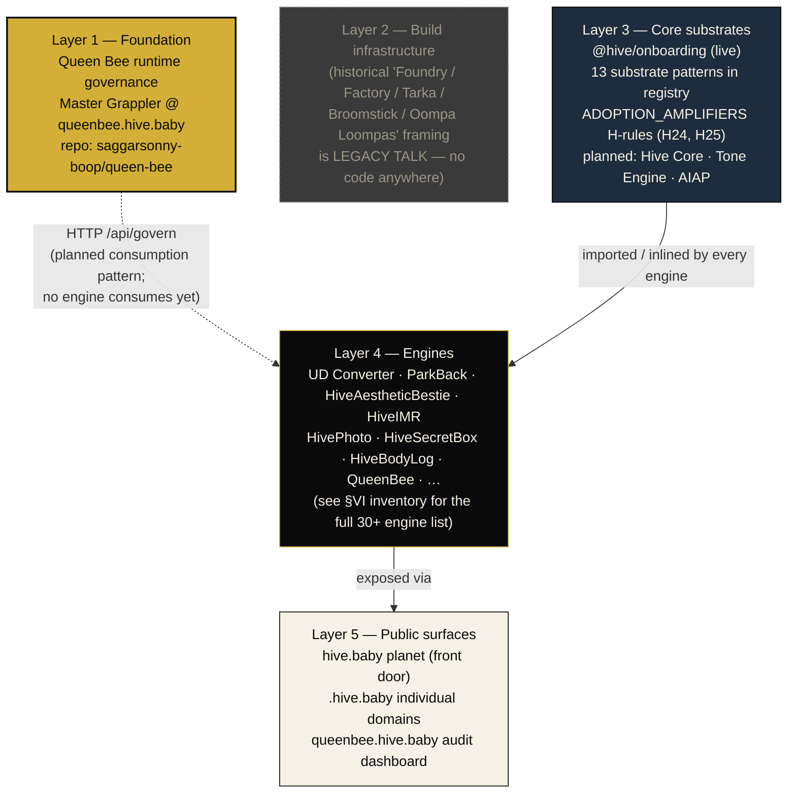
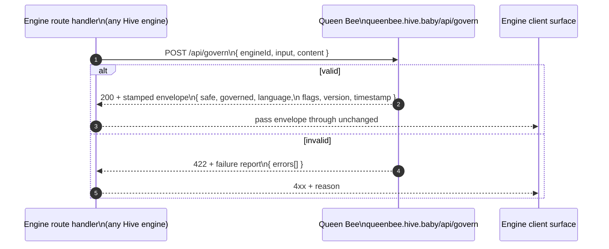
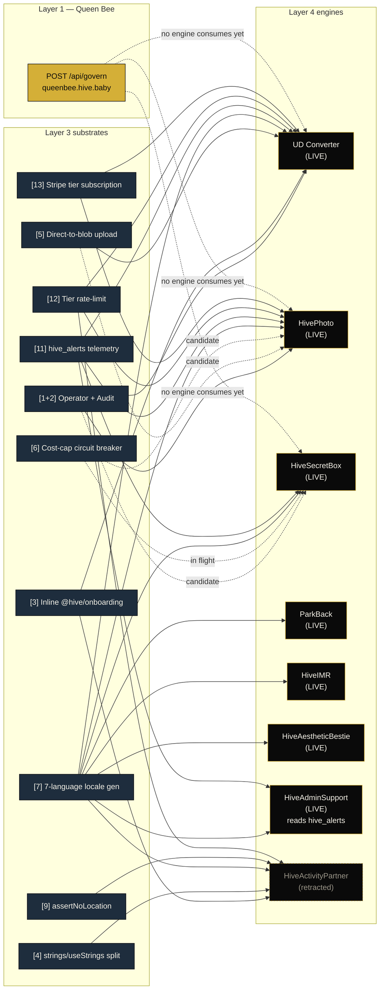
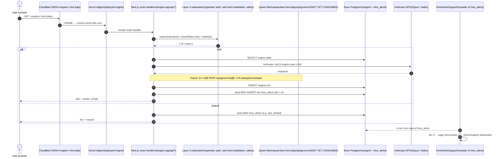
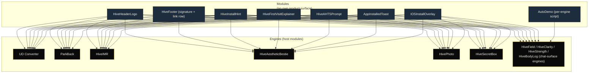

# Hive Architecture

> **v0.2 — 2026-05-08.** This is the pan-Hive architecture map intended to be visible from every chat, every CC session, every onboarding pass. It exists so a question like *"where does HiveAestheticBestie fit?"* or *"which substrate does this engine inherit?"* has one canonical answer.
>
> v0.2 incorporates T1's Queen Bee discovery PR ([Constitution §VII](HIVE_CONSTITUTION.md#vii-queen-bee-architecture--queen_bee_location)). Layer-1 Queen Bee is now canonized (the runtime governance engine at `queenbee.hive.baby`, not a baseline config). The Layer-2 Foundry/Factory framing has been **retired as legacy talk** — those names don't correspond to anything in any repo. Layer-3 Tone Engine / AI Activity Partner / Hive Core are explicitly **planned-not-built**. The "27 adoption amplifiers" framing has been corrected: HiveOps' formal `ADOPTION_AMPLIFIERS` H-rule category currently has just **two** rules (H24, H25); the rest of what v0.1 listed is real-but-uncategorized HiveOps coverage from other rule families. v0.2 changelog at the bottom of this doc.

## How to read this document

Four kinds of thing live in the Hive. Conflating them is the most common confusion.

| Concept | Owns? | Lifespan | Examples |
|---|---|---|---|
| **Engine** | Own purpose, workflows, output, public domain, pricing tier, DB schema, `ENGINE_GRAMMAR.md`. | Indefinite, until retired. | UD Converter, ParkBack, HiveAestheticBestie, HiveSecretBox, HiveIMR, **Queen Bee**. |
| **Module** | Attaches to an engine via API import or component import. **No own product surface, no own deployment**. Build time hours, not days. | Lives as long as its host engine. | Hive header logo, footer signature, install hint banner, age-band gate, AHTS prompt. |
| **Substrate** | Registry-tracked pattern extracted when 3+ engines adopt it. May evolve into a shared `@hive/*` package. | Tracked indefinitely; entry becomes a historical pointer when extracted. | Operator role + audit dashboard, `hive_alerts` telemetry, tier-based rate limiting, Stripe tier subscription, 7-language locale generator. |
| **Adoption amplifier** | Cross-cutting growth/retention feature an engine inherits as part of the Hive integration contract. | Locked to the contract; HiveOps enforces presence. | Manifest registration in layout, viewport meta. The broader set is **conceptual** — see Layer 3. |

**Rule of thumb.** If it has a Vercel project, it's an engine. If it's a React component imported by other engines, it's a module. If it's a TypeScript pattern repeated across engine source trees, it's a substrate. If it's a behavior every engine must exhibit (because the contract says so), it's an adoption amplifier.

Engines are the only thing the user directly experiences. The rest is how they're made and held together.

> **Note on Queen Bee.** Queen Bee is **both** a conceptual layer-1 foundation **and** an actual deployed engine (`queen-bee` repo, `queenbee.hive.baby`). Layer 1 of this map is the runtime governance Queen Bee provides; the engine inventory in Layer 4 is where Queen Bee shows up as a Hive engine like any other.

---

## The five-layer stack

The layers are a **vertical inheritance stack**. Layer 1 (Queen Bee) is the runtime governance an engine *can* inherit by calling its HTTP API. Layer 3 substrates are imported into engine source trees. Layer 5 surfaces are how users reach Layer 4 engines. Layer 2 is rendered greyed-out because the historical Foundry/Factory framing has no correspondence in code today; it is preserved here only so future readers can see the framing was considered and retired.

The Layer-1 → Layer-4 arrow is **dotted** because no engine in production calls `POST /api/govern` yet (per Constitution §VII honest-gap report). Queen Bee is deployed and ready; the inheritance pattern is established but not yet consumed.

---

## Layer 1 — Queen Bee runtime governance

Queen Bee is the **runtime governance engine** of the Hive ecosystem — the Master Grappler in production. The canonical reference for this layer is [Constitution §VII "Queen Bee Architecture"](HIVE_CONSTITUTION.md#vii-queen-bee-architecture--queen_bee_location); CC's standing rule is `[QUEEN_BEE_LOCATION]` (CLAUDE.md B18): before scaffolding safety enforcement, output schema validation, language detection, compliance audits, or cross-engine reachability monitoring into any new engine, check what Queen Bee already provides and inherit from it.

### Where Queen Bee lives

| Field | Value |
|---|---|
| Repo | [`saggarsonny-boop/queen-bee`](https://github.com/saggarsonny-boop/queen-bee) |
| Vercel deployment | `queen-bee-v1.vercel.app` |
| Public domain | `queenbee.hive.baby` |
| Stack | Next.js 16.2.4 + React 19.2.4 + TypeScript + Anthropic SDK |
| Status | BUILDING — governance engine in progress (per its `ENGINE_GRAMMAR.md`) |
| Master Grappler version | `0.2.0` (envelope stamp) |

### What's actually built (verified 2026-05-08)

| Component | File | Status |
|---|---|---|
| Master Grappler | `lib/grappler.ts` | Implemented. Schema field validation, safety check, language detection (zh / ar / ja / ru / en heuristic), QB envelope stamping. |
| Engine registry | `lib/registry.ts` | **14 engines** registered with `id, name, domain, status, tone, safety, schema, multilingual, description`. |
| Safety enforcement | `lib/safety.ts` | Tiered rules: universal blocks (suicide/self-harm, weapons synthesis, CSAM); standard blocks; medical-flag patterns; elevated-flag patterns; per-tier disclaimer requirements. |
| Output schemas | `lib/schemas.ts` | Required-field map for **15 schema types** (`time-response`, `clarity-response`, `scenario-response`, `coaching-response`, `health-log-response`, `governance-response`, `moon-response`, `lookup-response`, `builder-response`, `conversion-response`, `reader-response`, `creator-response`, `validator-response`, `secret-response`, `generic`). |
| Public API | `app/api/` | `POST /api/govern` (validate + stamp), `GET /api/registry`, `GET /api/audit` (dashboard data), `GET /api/health` (live engine reachability). |
| Audit dashboard | `app/page.tsx` | Live UI at `queen-bee-v1.vercel.app` rendering reachability + governed-flag for every registered engine. |
| Onboarding stack | `components/{AutoDemo,FirstVisitCard,TooltipTour}.tsx` | Implemented in the QB engine itself. |

### Inheritance mechanism — HTTP, not a package

An engine inherits from QB by:

1. **Registering** in `queen-bee/lib/registry.ts` with `{id, name, domain, status, tone, safety, schema, multilingual, description}`. The slug becomes the `engineId` it sends to the Grappler.
2. **Calling** `POST https://queenbee.hive.baby/api/govern` with `{engineId, input, content}` before returning each output.
3. **Returning the envelope** to the client unchanged — it carries `safe`, `governed`, `language`, `flags`, `version`, `timestamp` fields the client surface can render.

There is no shared library yet. A future `@hive/grappler-client` package becomes plausible once two or more engines are calling `/api/govern` in production.

### Honest gap — adoption status

As of 2026-05-08, **no Hive engine in any monorepo or standalone repo actually calls `/api/govern` in production**. Verified by `grep -r "queenbee\.|api/govern|queen-bee-v1" --include="*.ts" --include="*.tsx"` across `hivebaby/apps/`, `hivebaby/packages/`, `universal-document/apps/`, and the standalone engine repos.

The 14 engines in `queen-bee/lib/registry.ts` are *registered* (so QB knows about them and can audit their reachability) but not *governed* (they don't route their outputs through QB). The audit dashboard's `governed: true` is a reachability check, not proof the engine called QB.

Queen Bee is deployed and ready; the inheritance pattern is established in code but not yet consumed. The first engine to wire `/api/govern` is also documenting the wiring pattern for the next.

### Relationship to §V Substrate Registry

The [Substrate Registry (`docs/QUEEN_BEE_SUBSTRATES.md`)](QUEEN_BEE_SUBSTRATES.md) and the Queen Bee runtime engine are **distinct artefacts that share a name**:

- The Substrate Registry is a markdown ledger listing 13 reusable code patterns. Engines copy patterns *out* of the registry into their codebases.
- The Queen Bee Engine is a deployed runtime service. Engines *call into* it via HTTP.

A pattern in the registry can move toward "consumed via QB" rather than "extracted to a package" — for example, the safety-disclaimer pattern is already enforced inside QB's `lib/safety.ts`. Patterns that are ergonomically embedded (strings/useStrings split, operator cookie) will probably stay package-bound; patterns that are ergonomically remote (safety classification, schema validation, language detection) belong in QB.

---

## Layer 2 — Build infrastructure (legacy talk; retired)

Earlier conversations referred to a **Foundry** (a builder UI) and a **Factory** (Tarka, Broomstick, Oompa Loompas) at this layer. Per [Constitution §VII](HIVE_CONSTITUTION.md#things-described-elsewhere-that-dont-exist-yet), **none of these names corresponds to anything in any repo as of 2026-05-08**:

- No code, no docs, no anchors in `hivebaby`, `queen-bee`, `universal-document`, or any engine repo for "Foundry", "Tarka", "Broomstick", "Oompa Loompas", or "Hive Core".
- If they were ever shipped, they've since been deleted or renamed; no commit history surfaces them.
- The runtime governance role those names were probably reaching for is now the Master Grappler in the queen-bee repo (Layer 1, above).

`HiveEngineBuilder` (`hiveenginebuilder.hive.baby`) exists and is LIVE, but it's a **deployed engine** in Layer 4 — not a special "Foundry" tier. v0.1 of this map placed HiveEngineBuilder in Layer 2 as the Foundry; v0.2 moves it into Layer 4 with the rest of the engines.

> **Treat references to Foundry / Factory / Tarka / Broomstick / Oompa Loompas as legacy talk pending evidence to the contrary.** If a future PR introduces real codebases under these names, this section gets rewritten with the canonical scope and file paths. Until then, this layer is intentionally empty.

---

## Layer 3 — Core substrates

Things that live across engines without being engines themselves.

### Core packages — shipped + planned

| Package | Status | What it is |
|---|---|---|
| `@hive/onboarding` (`packages/hive-onboarding/`) | **live (v0.1)** | The PWA install hint, first-visit explainer, AHTS prompt, install toast, 7-locale catalog. Canonical source for the install + onboarding behavior every engine ships. |
| `@hive/auth` | **planned** (substrate registry [1+2]) | Operator role + audit dashboard. 2 engines using the pattern today. |
| `@hive/alerts` | **planned** (substrate registry [11]) | `hive_alerts` ledger emitter. 4+ engines write today. |
| `@hive/rate-limit` | **planned** (substrate registry [12]) | Tier-based rate limiter. 3 engines today. |
| `@hive/stripe-tiers` | **planned** (substrate registry [13]) | Plus / Pro tier checkout + webhook + signed cookie verification. |
| `@hive/i18n-generate` (tool, hivebaby-resident) | **planned** (substrate registry [7]) | Anthropic-Haiku-driven 7-language translator. Every engine uses it; today it's duplicated. |
| `@hive/grappler-client` | **plausible** | HTTP client for `POST /api/govern`. Becomes worth building once 2+ engines call QB. |

The 13 substrate patterns currently in flight are tracked in [`docs/QUEEN_BEE_SUBSTRATES.md`](QUEEN_BEE_SUBSTRATES.md). When a substrate crosses the 3-engine threshold, it's extracted into a real package and graduates from the registry into this list.

### Tone Engine, AI Activity Partner, Hive Core — planned, not yet built

Earlier conversations placed Tone Engine, AI Activity Partner (AIAP), and Hive Core at this layer. **None of them exists in any repo today** (verified per Constitution §VII honest-gap report).

| Concept | Status | What it would be |
|---|---|---|
| Tone Engine | **planned, not yet built** | Writing-voice consistency layer; ensures user-facing copy reads as the same product family. May land as a prompt-template set, a CLI lint, or a QB module. Waiting on the first consuming engine to validate the pattern. |
| AI Activity Partner | **planned, not yet built** | Cross-engine conversational companion module. **Distinct from the retracted `hive-activity-partner` engine** — that was a product, this would be infrastructure (a guidance chat that floats over any engine). Waiting on the first consuming engine. |
| Hive Core | **planned, not yet built** | The cross-engine substrate for the integration contract. Likely overlaps with the `@hive/*` package set. Waiting on consolidation pattern from QB consumers. |

The pattern is the same in every case: build it when an engine actually needs it, not as speculative infrastructure. The first engine to call `/api/govern` will probably also be the first engine that surfaces what Tone Engine and AIAP need to be.

### Adoption amplifiers — the honest count

The HiveOps `ADOPTION_AMPLIFIERS` H-rule category formally contains **two rules** today:

- **H24** — manifest registration in layout (the engine actually mounts `manifest.json` via `<link rel="manifest" />`).
- **H25** — viewport meta correctly set for mobile installability.

That's the canonical list. Earlier framings of "27 adoption amplifiers" were aspirational — no canonical list of 27 exists in any repo on 2026-05-08, and v0.1 of this map enumerated 25 items that mostly belong to OTHER H-rule categories (HIVE_INTEGRATION for the header logo + footer signature, DESIGN_CONSISTENCY for the Hive gold + theme color, OPERATIONAL for the health endpoint, INTERNATIONALIZATION for the 7-locale set, etc.). Those rules are real and enforced — they just aren't `ADOPTION_AMPLIFIERS`.

**For the actual list of HiveOps rules, see `tools/hive-ops/README.md` and Constitution §V.** Future PRs that introduce a true 27-amplifier curation should link this section, and v0.3 of this doc can update the count from canonical source.

---

## Layer 4 — Engines (the things users actually use)

Every engine listed in CLAUDE.md §D + Constitution §VI inventory. Status as of 2026-05-06 sweep + 2026-05-08/09 migrations.

### Hivebaby-resident engines (audited by HiveOps)

| Engine | Slug | Domain | Status | HiveOps verdict |
|---|---|---|---|---|
| ParkBack | `parkback` | parkback.hive.baby | LIVE | ✅ PASS (V01/V18/V19 waived) |
| HiveActivityPartner | `hive-activity-partner` | activitypartner.hive.baby | BUILDING (Phase 1 — being retracted; companion-module redesign) | ✅ PASS with V18/V19 warns |
| HiveAestheticBestie | `hive-aestheticbestie` | hiveaestheticbestie.hive.baby | LIVE | ✅ PASS |
| HivePhoto | `hive-hivephoto` | hivephoto.hive.baby | LIVE | ✅ PASS |
| HiveIMR | `hive-imr` | hiveimr.hive.baby | LIVE | ✅ PASS |
| HiveSecretBox | `secret-box` | secretbox.hive.baby | LIVE | ✅ PASS (canonical migration #5, 2026-05-09) |
| HivePlainScan | `hive-plainscan` | plainscan.hive.baby | DORMANT (no DNS, no demand) | ⚠️ WARN (overrides expire 2026-06-05) |

### Hivebaby-resident, separate nested git repo

| Engine | Slug | Domain | Status | HiveOps verdict |
|---|---|---|---|---|
| HiveIMGTrainer | `imgtrainer` | imgtrainer.hive.baby | LIVE | (skipped — nested repo; tracked in imgtrainer's own repo) |

### Other Hive engines (per CLAUDE.md D inventory; HiveOps verdict mostly manual)

| Engine | Domain | Status | Notes |
|---|---|---|---|
| HiveMoon | hivemoon.hive.baby | LIVE | Client-only Next.js |
| HiveField | hivefield.hive.baby | LIVE | Anthropic |
| HiveClock | hiveclock.hive.baby | LIVE | Anthropic |
| HiveClarity | hiveclarity.hive.baby | LIVE | Anthropic |
| HiveStrength | hivestrength.hive.baby | LIVE | Anthropic |
| HiveBodyLog | hivebodylog.hive.baby | LIVE | Anthropic |
| HiveEngineBuilder | hiveenginebuilder.hive.baby | LIVE | Engine builder UI. **Was placed in Layer 2 in v0.1; moved to Layer 4 in v0.2** (the "Foundry" framing was retired). |
| QueenBee | queenbee.hive.baby | BUILDING | The runtime governance engine; see Layer 1 for canonical detail. |
| HiveCreatorConsole | creatorconsole.hive.baby | LIVE | |
| WhoTextedMe | whotextedme.hive.baby | LIVE | Anthropic |
| HiveAdminSupport | support.hive.baby | LIVE | Reads `hive_alerts`; routes inbound emails |
| HiveMeme | hivememe.hive.baby | BUILDING | Anthropic |
| HiveMicroRitual | hivemicroritual.hive.baby | LIVE | Anthropic |
| HiveMemorySpace | hivememoryspace.hive.baby | BUILDING | Anthropic |
| SovereignArbitrage | sovereignarbitrage.hive.baby | LIVE | Anthropic |
| UniversalDocumentInc | universaldocument.hive.baby | LIVE | UD hub landing |

### UD ecosystem (separate repo `saggarsonny-boop/universal-document`)

| Engine | Domain | Status |
|---|---|---|
| UD Converter | converter.hive.baby | LIVE — ⚠️ WARN (V19 → 2026-06-07) |
| UD Creator | creator.hive.baby | LIVE |
| UD Reader | reader.hive.baby | LIVE |
| UD Validator | validator.hive.baby | LIVE |
| UD Utilities | utilities.hive.baby | LIVE |
| UD Signer | signer.hive.baby | LIVE |

### HiveVitality

**Scope defined; build pending Queen Bee consumption pattern from first engine.** HiveVitality does not appear in the Constitution §VI inventory, CLAUDE.md D inventory, or any repo on 2026-05-08. It will land once one of the existing engines (most plausibly HiveBodyLog or HivePhoto) demonstrates the QB consumption pattern end-to-end and that pattern can be reproduced for a vitality-specific surface.

---

## Per-engine inheritance map

Which engines inherit which substrates (substrate registry pattern numbers in brackets). Read top-down: each engine plugs in only the substrates it actually uses.

> The full adoption table is in [`docs/QUEEN_BEE_SUBSTRATES.md`](QUEEN_BEE_SUBSTRATES.md) under "Substrate Adoption Tracker." This diagram visualizes the same data — substrates are extracted to `@hive/*` packages when a column hits 3+ live engines. The Queen Bee `/api/govern` arrows are dotted because no engine consumes the API yet (Constitution §VII honest-gap report).

---

## Data flow — a user request through the layers

How a request from a user's browser flows through DNS → edge → route handler → substrates → optionally Queen Bee → DB / Anthropic, and back to the client.

The edge → route handler → substrate stack → DB / Anthropic shape is the **same on every engine**. What varies is which substrates it composes. The QB hop is **not yet wired in any engine** — it's drawn here as a `Note over` so the diagram shows where it would land when the first engine adopts the pattern.

---

## Module reuse — which modules attach to which engines

Modules are React components imported from `@hive/onboarding` (or its inlined sibling) and from per-engine module files. They have no Vercel project, no DB, no domain — they are presentational + behavioural fragments.

Modules 1–7 ship in `@hive/onboarding`. Engines either consume the workspace package directly (hivebaby-resident engines) or inline a copy at `<engine>/lib/hive-onboarding/` (external repos, per substrate registry pattern 3). Module 8 (AutoDemo) is per-engine — the script body is engine-specific, but the typewriter/fade behavior is shared.

---

## Layer 5 — Public surfaces

| Surface | URL | Role |
|---|---|---|
| **The planet** | `https://hive.baby` | The front door. Three.js scene with hex cells, one per engine. Live engines glow `#D4AF37`; "coming soon" cells are faded grey; the patronage cell is amber/copper. |
| **Individual engine domains** | `<engine>.hive.baby` | Each engine's own UI surface, accessed directly by URL or via planet fly-through. |
| **Queen Bee audit dashboard** | `https://queenbee.hive.baby` | Live UI rendering reachability + governed-flag for every registered engine (read from `/api/audit`). |
| **Patrons page** | `https://hive.baby/patrons.html` | Voluntary support surface. Linked from the planet's amber/copper cell. |

The planet is **the only Hive surface a casual visitor sees**. Every engine listing in §VI has an entry in the planet's `ENGINES` array (HiveOps H21). Patronage is the only commercial surface on the planet itself — engine paid tiers live on each engine's own domain.

---

## Changelog

### v0.2 — 2026-05-08

- Queen Bee canonical surface added per [Constitution §VII](HIVE_CONSTITUTION.md#vii-queen-bee-architecture--queen_bee_location): repo `saggarsonny-boop/queen-bee`, deployed at `queenbee.hive.baby`, runtime governance via `POST /api/govern` (HTTP not config; no engine consumes yet).
- Foundry / Factory / Tarka / Broomstick / Oompa Loompas marked as **legacy talk pending evidence** — no code anywhere in the colony as of 2026-05-08.
- AI Activity Partner / Tone Engine / Hive Core marked as **planned-not-built**. Each waits on the first consuming engine to validate the pattern.
- HiveVitality: **scope defined, build pending Queen Bee consumption pattern from first engine**.
- Adoption amplifier count corrected: HiveOps `ADOPTION_AMPLIFIERS` rule category currently has just **2 rules** (H24, H25). The previous v0.1 list of 25 mostly corresponded to other H-rule categories (HIVE_INTEGRATION, DESIGN_CONSISTENCY, OPERATIONAL, INTERNATIONALIZATION) and was misplaced.
- HiveEngineBuilder moved from Layer 2 (Foundry) to Layer 4 (just an engine).
- HiveSecretBox audit verdict updated to ✅ PASS (canonical migration #5, 2026-05-09).
- Five-layer Mermaid diagram: Layer 2 rendered greyed-out + dashed; Layer 1 → Layer 4 dotted (consumption gap).
- Per-engine inheritance map: added Queen Bee `/api/govern` node with dotted lines to candidate engines.
- Data-flow sequence: added `Note over` for the future QB hop.
- Re-cast Queen Bee section to point CC at CLAUDE.md `B18` / `[QUEEN_BEE_LOCATION]` standing rule.

### v0.1 — 2026-05-08

- Initial map. Five-layer stack, conceptual model, Mermaid diagrams (5-layer, Foundry/Factory detail, per-engine substrate map, request data flow, module reuse), engine inventory + HiveOps verdicts, 25-of-27 adoption amplifiers list (anchored to H-rules then known).
- Sections marked **AWAITS T1 PR** for content T1's Queen Bee discovery PR was expected to land canonically. v0.2 above resolves all of those.

---

## Pointers

- **Queen Bee runtime governance:** [Constitution §VII](HIVE_CONSTITUTION.md#vii-queen-bee-architecture--queen_bee_location) · CLAUDE.md `B18` · `[QUEEN_BEE_LOCATION]` · `https://github.com/saggarsonny-boop/queen-bee` · `queenbee.hive.baby`
- **Engines:** Constitution §VI · CLAUDE.md §D · `engines.json`
- **Substrates:** [`docs/QUEEN_BEE_SUBSTRATES.md`](QUEEN_BEE_SUBSTRATES.md)
- **HiveOps rules (the actual list):** `tools/hive-ops/README.md` · Constitution §V `[HIVEOPS_v01]`
- **Modules (`@hive/onboarding`):** `packages/hive-onboarding/`
- **Governance:** [`docs/HIVE_CONSTITUTION.md`](HIVE_CONSTITUTION.md) · [`MEMORY.md`](../MEMORY.md) · [`CLAUDE.md`](../CLAUDE.md)
- **Engine launch checklist:** [`docs/HIVE_ENGINE_FINALIZATION_CHECKLIST.md`](HIVE_ENGINE_FINALIZATION_CHECKLIST.md)

---

*Maintained by Sonny. PR-only updates per `[GOVERNANCE_LOCATION]`. v0.2 — 2026-05-08.*
